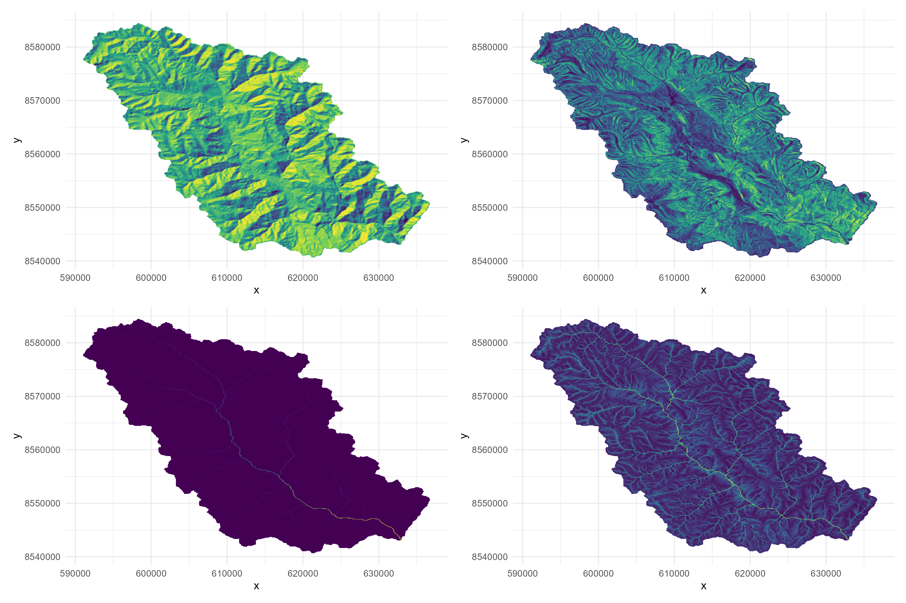

# Soil, Topography and Climate Analysis Tools

This repository contains R scripts for download and processing soil, topography, and climate data using various R packages including Terra, RSAGA, WhiteBox, and Geodata.



## Table of Contents

## Repository Overview

This toolset allows for:

- Digital Elevation Model (DEM) acquisition and processing
- Terrain analysis (slope, aspect, TPI, etc.)
- Hydrological modeling and analysis
- Climate data acquisition and processing
- Soil data acquisition

## Required Packages

The following R packages are required:

```r
# Spatial data handling
library(terra)     # Modern spatial data processing
library(sf)        # Simple features for R

# Elevation data
library(elevatr)   # For downloading elevation data

# Terrain analysis
library(whitebox)  # WhiteBox tools interface
library(RSAGA)     # SAGA GIS interface

# Climate and soil data
library(geodata)   # For downloading climate and soil data

# Visualization
library(ggplot2)   # Data visualization
library(patchwork) # Combine plots
```

## Script Descriptions

### 1. Terra Package (`1_use_terra.R`)

Uses the `terra` package for:

- Extracting point elevations
- Downloading DEMs from different sources (AWS, ALOS, SRTM)
- Basic terrain analysis (slope, aspect, TPI, TRI)
- Hydrological analysis (flow direction, flow accumulation, watershed delineation)
- Visualization of results

### 2. RSAGA Package (`2_use_rsaga.R`)

Uses SAGA GIS via the `RSAGA` package for:

- Advanced terrain analysis (slope, aspect, curvature)
- Topographic Position Index (TPI)
- SAGA Wetness Index
- LS-Factor calculation for erosion modeling

### 3. WhiteBox Tools (`3_use_whitebox.R`)

Uses WhiteBox tools via the `whitebox` package for:

- Hillshade generation
- Slope calculation
- Hydrological analysis (depression filling, flow accumulation)
- Topographic Wetness Index (TWI) calculation

### 4. Climate and Soil Data (`4_climate_soil.R`)

Uses the `geodata` package for:

- Downloading WorldClim climate data
- Processing temperature and precipitation data
- Downloading and processing soil data from SoilGrids

## Data Structure

- `/data/`: Contains input data files

  - Watershed boundary shapefile (`borde_torobamba_geo.shp`)
  - Sample soil points (`soils_points.csv`)
- `/outputs/`: Directory for generated outputs

  - Processed DEM files
  - Terrain analysis results
  - Climate data

## Notes

- For WhiteBox Tools, initialization is required: `whitebox::wbt_init()`
- For OpenTopography API, a key needs to be set: `elevatr::set_opentopo_key()`
- For SAGA tools, environment setup may be required

## Example Outputs

The scripts generate various outputs including:

- DEM files in different formats
- Terrain derivatives (slope, aspect, etc.)
- Hydrological indices (TWI, flow accumulation)
- Climate and soil rasters

All outputs are saved in the `/outputs/` directory with visualization plots.
