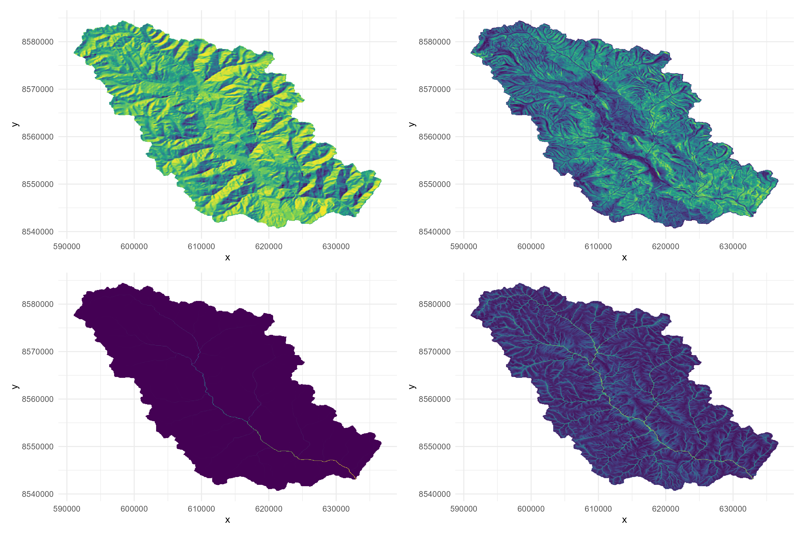
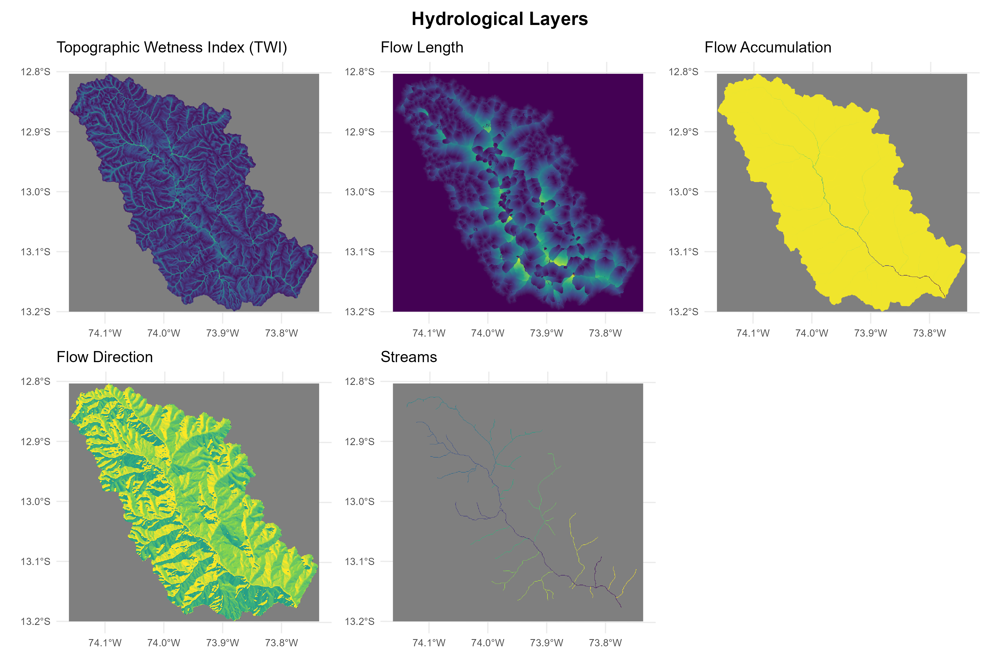
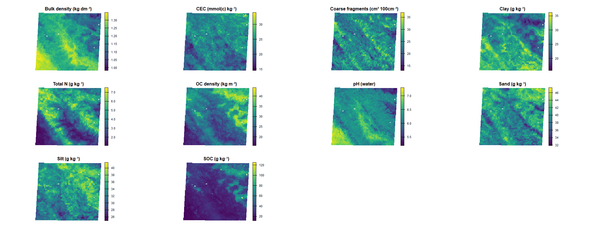
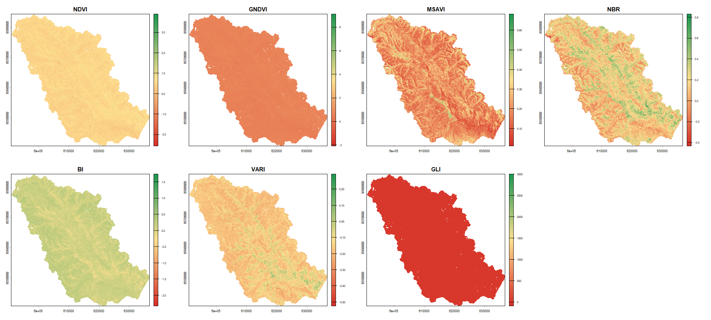

# Soil, Topography and Climate Analysis Tools

This repository contains R scripts for download and processing soil, topography, and climate data using various R packages including Terra, RSAGA, WhiteBox, rgrass, and Geodata.



## Table of Contents

## Repository Overview

This toolset allows for:

- Digital Elevation Model (DEM) acquisition and processing
- Terrain analysis (slope, aspect, TPI, etc.)
- Hydrological modeling and analysis
- Climate data acquisition and processing
- Soil data acquisition
- Vegetation index computation from satellite imagery

## Required Packages

The following R packages are required:

```r
# Spatial data handling
library(terra)     # Modern spatial data processing
library(sf)        # Simple features for R

# Elevation data
library(elevatr)   # For downloading elevation data

# Terrain and hydrological analysis
library(whitebox)  # WhiteBox tools interface
library(RSAGA)     # SAGA GIS interface
library(rgrass)   # GRASS GIS interface

# Climate and soil data
library(geodata)   # For downloading climate and soil data

# Satellite imagery and spectral indices
library(rsi)       # Download STAC imagery and compute spectral indices

# Visualization
library(ggplot2)   # Data visualization
library(patchwork) # Combine plots
library(tidyterra) # ggplot2 methods for SpatRaster
```

## Script Descriptions

### 1. Terra Package (`1_use_terra.R`)

Uses the `terra` package for:

- Extracting point elevations
- Downloading DEMs from different sources (AWS, ALOS, SRTM)
- Basic terrain analysis (slope, aspect, TPI, TRI)
- Hydrological analysis (flow direction, flow accumulation, watershed delineation)
- Visualization of results

### 2. RSAGA Package (`2_use_rsaga.R`)

Uses SAGA GIS via the `RSAGA` package for:

- Advanced terrain analysis (slope, aspect, curvature)
- Topographic Position Index (TPI)
- SAGA Wetness Index
- LS-Factor calculation for erosion modeling

### 3. WhiteBox Tools (`3_use_whitebox.R`)

Uses WhiteBox tools via the `whitebox` package for:

- Hillshade generation
- Slope calculation
- Hydrological analysis (depression filling, flow accumulation)
- Topographic Wetness Index (TWI) calculation

### 4. Climate and Soil Data (`4_climate_soil.R`)

Uses the `geodata` package for:

- Downloading WorldClim climate data
- Processing temperature and precipitation data
- Downloading and processing soil data from SoilGrids

### 5. rgrass tools (`5_use_rgrass.R`)

Uses the `rgrass` package to interface with GRASS GIS for:

- Setting up and initializing a GRASS environment
- Topographic analysis (slope, aspect, relief)
- Hydrological analysis:
  - Topographic Wetness Index (TWI)
  - Flow length calculation
  - Flow direction and accumulation
  - Stream network delineation
- Cost surface analysis for path planning
- Visualization of topographic and hydrological variables

The script demonstrates how to:
- Import/export data between R and GRASS
- Use GRASS's powerful command-line tools from within R
- Generate publication-quality visualizations of terrain derivatives
- Process and export multiple hydrological indices



### 6. SoilGrids 250 m Download (`6_soilgrids_download.R`)

Streams all 10 SoilGrids 2.0 soil properties at 15–30 cm depth directly from
ISRIC via GDAL `/vsicurl/`, without downloading full global files. Uses `terra`
and `sf` for reprojection, cropping, and point extraction.

**Variables downloaded** (depth: 15–30 cm, statistic: mean):

| Variable | Description | Physical unit |
|----------|-------------|---------------|
| `bdod` | Bulk density of fine earth | kg dm⁻³ |
| `cec` | Cation exchange capacity | mmol(c) kg⁻¹ |
| `cfvo` | Coarse fragments volumetric | cm³ 100cm⁻³ |
| `clay` | Clay content | g kg⁻¹ |
| `nitrogen` | Total nitrogen | g kg⁻¹ |
| `ocd` | Organic carbon density | kg m⁻³ |
| `phh2o` | pH (water 1:2.5) | pH |
| `sand` | Sand content | g kg⁻¹ |
| `silt` | Silt content | g kg⁻¹ |
| `soc` | Soil organic carbon | g kg⁻¹ |

**Workflow:**
1. Stream each variable from the ISRIC VRT endpoint at native 250 m resolution
2. Crop to the study-area boundary and scale raw integers to physical units
3. Reproject to UTM and assemble a 10-band GeoTIFF stack
4. Extract values at soil profile locations and export to CSV
5. Plot all variables as a multi-panel map

**Outputs:**
- `data/soilgrids_250m/soilgrids_<var>_15-30cm.tif` — individual rasters
- `data/soilgrids_250m/soilgrids_stack_utm.tif` — 10-band UTM stack
- `data/soilgrids_250m/soilgrids_at_points.csv` — values at soil profile points
- `figures/sg_maps_250m.png` — multi-panel map of all variables



### 7. Vegetation Indices from Landsat (`7_download_vegetation_indices_rsi.R`)

Downloads Landsat 8/9 Collection 2 Level-2 imagery via the `rsi` package (STAC API),
computes 10 spectral vegetation indices, and pairs them with soil sampling point
locations for downstream modelling.

**Workflow:**
1. Load the study-area polygon, reproject to UTM Zone 18S (EPSG:32718), and build a bounding-box AOI
2. Download a cloud-masked, median-composited Landsat scene for the growing season (May–Aug)
3. Crop and mask the imagery to the study-area boundary
4. Query the [Awesome Spectral Indices](https://github.com/awesome-spectral-indices/awesome-spectral-indices) database and compute 10 indices
5. Extract index values at soil profile locations and export to CSV
6. Generate spatial maps, a NDVI + sample-points overlay, and a boxplot of index distributions

**Indices computed:**

| Index | Formula | Description |
|-------|---------|-------------|
| NDVI  | (N−R)/(N+R) | General greenness; most cited VI worldwide |
| MSAVI | Modified SAVI | Reduces soil-brightness effects |
| GNDVI | (N−G)/(N+G) | More sensitive to chlorophyll than NDVI |
| DVI   | N−R | Linear greenness; sensitive at high biomass |
| MBI   | — | Modified Brightness Index; highlights bare soils |
| VARI  | (G−R)/(G+R−B) | Atmospheric-resistant VI (visible bands only) |
| GLI   | — | Green Leaf Index; strong in dense canopies |
| BI    | — | Bare Soil Index; isolates unvegetated surfaces |
| NBR   | (N−S2)/(N+S2) | Sensitive to fire severity and dry biomass |
| NDMI  | (N−S1)/(N+S1) | Tracks canopy water content / moisture stress |

**Outputs:**
- `data/landsat_imagery_masked.tif` — cloud-masked Landsat composite (UTM)
- `data/vegetation_indices_masked.tif` — 10-band vegetation index stack
- `data/soils_with_indices.csv` — soil profile points with extracted index values
- `data/plots/key_vegetation_indices.png` — spatial maps of key indices
- `data/plots/ndvi_soil_points.png` — NDVI map overlaid with soil sampling locations
- `data/plots/indices_boxplot.png` — distribution of index values at sampling points



### 8. NASADEM Terrain & Hydrological Covariates (`8_nasadem_terrain_hydro.R`)

Loads four NASADEM 30 m DEM tiles for Peruvian basins (Huaral, Mantaro,
Pativilca, Tarma), mosaics them, reprojects to UTM Zone 18S (EPSG:32718),
and derives a comprehensive set of terrain and hydrological covariates using
`terra` and `whitebox`.

**Expected inputs** (place in `geodata/nasadem/`):

| File | Basin |
|------|-------|
| `nasadem_huaral.tif` | Huaral |
| `nasadem_mantaro.tif` | Mantaro |
| `nasadem_pativilca.tif` | Pativilca |
| `nasadem_tarma.tif` | Tarma |

**Terrain covariates** (terra + whitebox):

| Layer | Tool | Description |
|-------|------|-------------|
| `slope` | terra | Slope in degrees |
| `aspect` | terra | Aspect in degrees |
| `hillshade` | terra | Hillshade (azimuth 315°, altitude 45°) |
| `tpi` | terra | Topographic Position Index |
| `tri` | terra | Terrain Ruggedness Index |
| `roughness` | terra | Surface roughness |
| `northness` | terra | cos(aspect) — linearised northness |
| `eastness` | terra | sin(aspect) — linearised eastness |
| `curv_profile` | whitebox | Profile curvature |
| `curv_plan` | whitebox | Plan curvature |
| `curv_tangential` | whitebox | Tangential curvature |
| `multiscale_tpi` | whitebox | Multi-scale TPI |

**Hydrological covariates** (whitebox):

| Layer | Description |
|-------|-------------|
| `twi` | Topographic Wetness Index (D-infinity SCA + slope) |
| `flow_acc_d8` | D8 flow accumulation (cell count) |
| `sca_dinf` | D-infinity Specific Contributing Area |
| `ls_factor` | LS-Factor (erosion modelling) |
| `streams` | Stream network (threshold = 1 000 cells) |
| `strahler_order` | Strahler stream order |
| `elev_above_stream` | Elevation above nearest stream channel |
| `valley_depth` | Valley depth |

**Workflow:**
1. Load and mosaic four NASADEM tiles → `nasadem_mosaic_utm.tif`
2. Compute terrain covariates with `terra::terrain()` and whitebox curvature tools
3. Remove depressions (breach + fill) before flow routing
4. Derive flow direction, accumulation, TWI, LS-factor, and stream network
5. Assemble an 18-band covariate GeoTIFF stack
6. Export multi-panel PNG maps for terrain and hydrological layers

**Outputs** (all in `outputs/nasadem/`):
- `nasadem_mosaic_utm.tif` — mosaicked and reprojected DEM
- Individual covariate GeoTIFFs (one per variable)
- `nasadem_covariate_stack.tif` — 18-band multi-covariate stack
- `terrain_covariates.png` — 9-panel terrain map
- `hydro_covariates.png` — 6-panel hydrological map

## Data Structure

- `/data/`: Contains input data files
  - Watershed boundary shapefile (`borde_torobamba_geo.shp`)
  - Sample soil points (`soils_points.csv`)
- `/geodata/nasadem/`: NASADEM DEM tiles for each basin
- `/outputs/`: Directory for generated outputs
  - Processed DEM files
  - Terrain analysis results
  - Hydrological analysis results
  - Climate data
  - `/outputs/nasadem/`: NASADEM-derived covariates

## Notes

- For WhiteBox Tools, initialization is required: `whitebox::wbt_init()`
- For OpenTopography API, a key needs to be set: `elevatr::set_opentopo_key()`
- For SAGA tools, environment setup may be required
- NASADEM tiles must be placed in `geodata/nasadem/` before running script 8

## Example Outputs

The scripts generate various outputs including:

- DEM files in different formats
- Terrain derivatives (slope, aspect, etc.)
- Hydrological indices (TWI, flow accumulation)
- Climate and soil rasters

All outputs are saved in the `/outputs/` directory with visualization plots.
